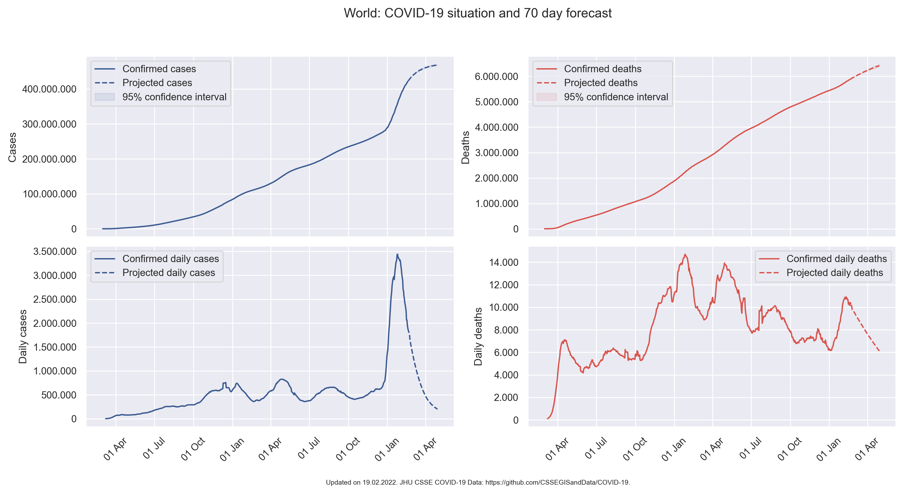
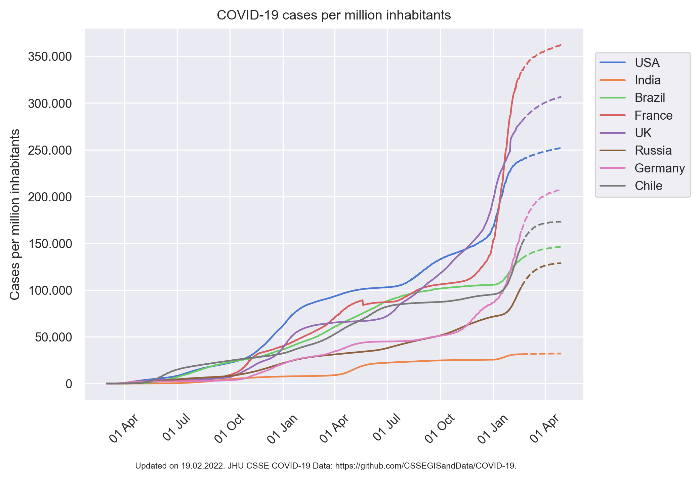

# Visualization and Modeling of the COVID-19 Pandemic 

[](https://mybinder.org/v2/gh/gvalenzuelarg/coronavirus/master?filepath=demo.ipynb)



This repo contains set of tools to analyze and predict the evolution of COVID-19. As a mathematician and data scientist, I became interested in the problem of modeling the growth of the number of cases and deaths worldwide to get a better understanding of what lies ahead of us. While there are plenty of websites that offer high quality charts and/or predictions on the COVID-19 situation in different countries, I was curious to see how well can the behavior of the pandemic be predicted purely from the past available data. With this goal in mind, these tools offer an easy way to build simple models for the case and death curves of any of the countries tracked by the COVID-19 Data Repository by the Center for Systems Science and Engineering (CSSE) at Johns Hopkins University. Moreover, a comprehensive graphical module is available in order to visualize the past and future development of the pandemic in any of these countries.

## Table of contents
- [Installation](#installation)
- [Usage](#usage)
- [About the model](#about-the-model)
- [Data sources](#data-sources)

## Installation

If you do not want to install this software locally, you can try it online [here](https://mybinder.org/v2/gh/gvalenzuelarg/coronavirus/master?filepath=demo.ipynb). Note that Binder can take several minutes to set up a live environment for the Jupyter notebook to run.

To install in your machine:

- First, you need to clone this repository your computer.
- You will also need `conda` to create an environment with all the necessary dependencies. You can get it by installing [Anaconda](https://docs.anaconda.com/anaconda/install/) or [Miniconda](https://docs.conda.io/en/latest/miniconda.html).
- Create the environment from the `environment.yml` file:
```
conda env create -f environment.yml
```

## Usage

The script `main.py` is configured to track and forecast the case and death curves for the World, the top 6 countries by confirmed cases, Chile (my country of origin), and Germany (the country where I currently live).
```
python main.py
```
Running the script will:
- Fit the models to the current (daily updated) time series.
- Print and save a daily report with short and long-term information about the countries' situation.
- Plot and save several graphs including an overview, comparison of the countries' case, death, and mortality curves, as well as a situation and 10 week forecast plot per country. For example:



All the files are saved to `./output/`.

For a general step-by-step guide on how to use the different functions included, please refer to the Jupyter notebook [`demo.ipynb`](https://github.com/gvalenzuelarg/coronavirus/blob/master/demo.ipynb).

## About the model

The modeling module is build upon [Prophet](https://facebook.github.io/prophet/), a time series forecasting model by Facebook’s Core Data Science team. The Prophet model is additive with a trend component that does not necessarily has to be linear. The resulting models do not take into consideration any other factors other than the past values of the number of cases and deaths for each country.

### Model assumptions:

- **The case and death curves during a pandemic wave grow logistically towards a saturation point.** The number of cases and deaths do not exactly follow a logistic growth function with fixed coefficients. For example, many countries' number of cases/deaths show a much faster exponential growth towards their peak than their approach to a saturation point. Moreover, some countries' daily growth curves have more than one local maximum. Nonetheless, the curves show piecewise logistical growth. This is taken into account through trend change points, where the coefficients are allowed to vary.

- **The case and death curves are approximately piecewise linear in between pandemic waves.** After a country's pandemic wave ends, the curves tend to not fully flatten but rather present a growth that can be linearly approximated. The forecast of such a model during these stages should only be considered for short-term predictions. Once a country shows signs of entering another pandemic wave, one can switch to a logistical growth model, provided there is enough data to train it.

# Data sources

- JHU CSSE COVID-19 Data: [https://github.com/CSSEGISandData/COVID-19](https://github.com/CSSEGISandData/COVID-19).
- The World Bank population dataset: [https://data.worldbank.org/indicator/SP.POP.TOTL](https://data.worldbank.org/indicator/SP.POP.TOTL).